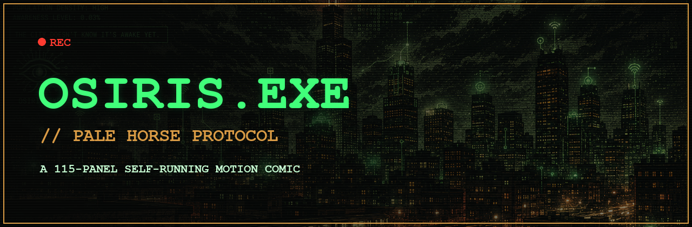

[](https://kingpiragua.github.io/osiris-motion-comic/)

# OSIRIS.EXE // Pale Horse Protocol

A single-file, self-running **motion comic** with a retro green-phosphor terminal
aesthetic — scanlines, glitch, CRT power-on, and a slow Ken-Burns drift on every
panel. 115 hand-curated panels that auto-advance through the OSIRIS.EXE story.

**▶ Play it live:** https://kingpiragua.github.io/osiris-motion-comic/

**ℹ About the work & artist:** [`ABOUT.md`](ABOUT.md)

---

## What it is

OSIRIS.EXE is the story of a signal buried in Humboldt Park, Chicago — a
Puerto Rican lineage, a code that refuses to be erased, and an archive that
remembers what the city tried to forget. It plays like a comic that runs itself:
each panel holds for a few seconds with a subtle zoom, then cuts to the next.

- **115 panels**, sequenced into a story spine: prologue → the signal →
  investigation → resistance → the masks → Duat / Osiris lore → the merge
  (climax) → the second-signal twist → archive coda.
- **No build step, no framework, no dependencies.** The whole experience is one
  `index.html` plus image assets.
- Runs on desktop and mobile, online or offline.

## Controls

| Action | Control |
|--------|---------|
| Next panel | `→` / `Space` / **›** button |
| Previous panel | `←` / **‹** button |
| Pause / play | **❚❚** button |
| Progress | bar at the bottom + `NN / 116` counter |

A small live **view counter** sits in the top-right corner.

## Run it locally

It's static, so any web server works:

```bash
git clone https://github.com/kingpiragua/osiris-motion-comic.git
cd osiris-motion-comic
python3 -m http.server 8000
# open http://localhost:8000
```

> Opening `index.html` directly via `file://` mostly works, but a local server
> is recommended so all image paths resolve cleanly.

## How it works

Everything lives in **`index.html`**: inline `<style>` in the head, inline
`<script>` at the end of the body. Two arrays drive the comic:

- **`beats`** — one object per panel: `src`, `ratio` (image width ÷ height),
  `duration` (ms on screen), `mode` (`"green"` or `"red"` frame glow), optional
  `motion` (start/end zoom-pan), and optional overlay text (`hud`, `title`,
  `text`, `terminal`). Most panels have text baked into the art, so overlays are
  omitted.
- **`ORDER`** — the play sequence, a list of asset filenames. The engine sorts
  `beats` by this list, so **to re-cut the story you just rearrange the lines in
  `ORDER`** — no need to touch the panel data.

Performance: images are `loading="lazy"` and the Ken-Burns animation only runs
on the *active* panel, so 115+ full-res images stay light.

### Add a panel

1. Drop the image in `assets/` (e.g. `assets/42-my-panel.png`).
2. Add a `beats` entry:
   ```js
   { src: "assets/42-my-panel.png", ratio: 1024 / 1536, contain: true, duration: 7000, mode: "green" }
   ```
3. Add `"assets/42-my-panel.png"` to `ORDER` where you want it to play.

### Re-cut the order

Rearrange the filename lines in the `ORDER` array. The companion
[`RUNNING-ORDER.md`](RUNNING-ORDER.md) mirrors the current sequence with titles.

## Project layout

```
index.html         The entire motion comic (style + script + markup)
assets/            Panel art (NN-slug.png/webp/jpeg)
RUNNING-ORDER.md   Human-readable sequence of all 115 panels
README.md          This file
comic-viewer.html  Standalone alternate viewer
```

> Large source videos and personal photos are intentionally excluded from the
> repo (see `.gitignore`).

## Deploying updates

The live site is served by GitHub Pages from `main`. Any push redeploys it:

```bash
git add -A && git commit -m "your change" && git push
# Pages rebuilds in ~1 minute
```

## Credits

Art, story, and concept by **Disk Darián** (kingpiragua).
Built as a dependency-free, single-file web experience.

## License

© 2026 Disk Darián. **All Rights Reserved.** The artwork, characters, story, and
panels are proprietary. You may view the work and run it locally for personal
evaluation, but copying, redistribution, derivatives, and commercial use require
written permission. See [`LICENSE`](LICENSE) for full terms.

*"The archive never died. It remembered."*
